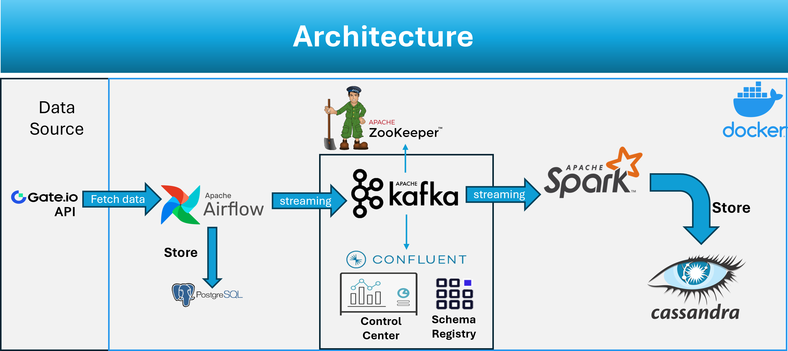

# Real-Time Data Streaming and Storage

## Overview
This project focuses on real-time data streaming and storage using Apache Airflow, Apache Kafka, Apache Cassandra, and Apache Spark. It's designed to fetch, process, and store cryptocurrency market data in a scalable and efficient manner.

## Features
1. **Data Fetching and Streaming**: Utilizes Apache Airflow and Kafka to fetch historical data of cryptocurrency from the Gate.io API and streams it in real-time.
2. **Data Processing with Spark**: Employs Apache Spark for processing the streamed data.
3. **Data Storage**: Uses Apache Cassandra for storing processed data, ensuring scalability and reliability.
4. **Real-time Data Update**: The system updates the data in near real-time, making it suitable for applications requiring up-to-date market information.

## Components
1. **Airflow DAG**: Manages the workflow of data streaming tasks, including periodic fetching and processing of data.
2. **Python Operators**: Python scripts for fetching data from the Gate.io API and streaming it using Kafka.
3. **Spark Session**: Establishes a connection with Spark for data processing.
4. **Kafka Connection**: Reads the data streamed by Airflow through Kafka.
5. **Cassandra Integration**: Manages the creation of keyspaces and tables, and insertion of data into Cassandra.
6. **Structured Streaming**: Utilizes Spark's structured streaming to process and store data into Cassandra in real-time.

## Docker Compose Setup
This project uses Docker Compose to manage its services. The `docker-compose.yml` file contains the configuration for the following services:
- Zookeeper
- Kafka Broker
- Schema Registry
- Control Center
- Airflow Webserver and Scheduler
- Postgres (for Airflow)
- Spark Master and Worker
- Cassandra

## Setup
1. **Airflow Setup**: Configured with specific start date and schedule to automate the data fetching process.
2. **Gate.io API**: Fetches cryptocurrency data like volume, open, close, high, and low values.
3. **Spark Configuration**: Set up to connect with Kafka and Cassandra, with necessary dependencies included.
4. **Kafka Producer**: Streams the fetched data to a specified Kafka topic.
5. **Cassandra Schema**: Defines the schema for the data to be stored in Cassandra.

## Usage
- Use Docker Compose to start the services: `docker-compose up -d`
- Run the `data_automation` DAG in Airflow to start the data fetching and streaming process.
- Spark processes the data and streams it to Cassandra, where it is stored.
- The system can be scaled as needed to handle larger data volumes or additional data sources.

## Technologies Used
- **Apache Airflow**: Workflow management and scheduling.
- **Apache Kafka**: Real-time data streaming.
- **Apache Spark**: Data processing and structured streaming.
- **Apache Cassandra**: NoSQL database for storing processed data.
- **Python**: Scripting and data manipulation.

## Requirements
- Apache Airflow
- Apache Kafka
- Apache Spark
- Apache Cassandra
- Python 3.10+
- Required Python libraries: `gate_api`, `pandas`, `cassandra-driver`, `pyspark`

## Installation
Instructions for setting up Apache Airflow, Kafka, Spark, and Cassandra are beyond the scope of this README. Refer to the respective official documentation for installation and setup guidelines.

